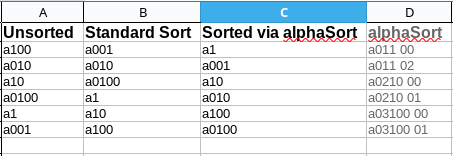

# Summary 
This funciton accepts a string as input and produces a string which when sorted upon will yield the results expected by most humans. 

## Example 
Consider the following series of numbers: [ a1, a001, a10, a010, a100, a0100 ]

The following screenshot shows the result of sorthing these values by the standard sort vs the value generated by alphaSort.

## Use

Place this code into your workbook or personal.xlsb workbook and reference accordingly 

e.g.

 * =alphasort([cell ref])
 * =Personal.xlsb!alphaSort([cell ref])

