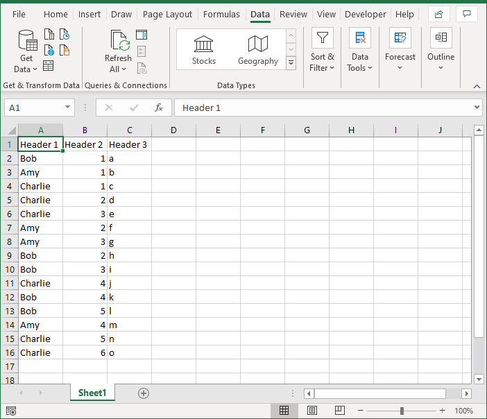

# Summary
The DisectData subroutine and related code will create a new worksheet for each unique value in the selected column. These new worksheets will contain only the data relative to the unique value. Each workwheet will be given the name of the unique value. 

## Example

## Use
  1. Select a cell in the desired colum. 
  1. Invoke the disectData subroutine by pressing Alt + F8. 
  1. Click "Yes" at the dialog box. 
  1. A new worksheet will be created for each value found in the column. The new worksheet will contain only the data relative to that value. 

## About 

### Modules
This function contains several modules 

  * basic : Contains simple functions that may be leveraged for other subroutines and functions
    * getLastRow : Returns the last used row of a worksheet
    * getLastCol : Returns the last used column of a worksheet
    * getColLetters : Converts a column number to the Alpha name of a column 
    * genericEH : A generic error handler 
    * WSRename : Renames a worksheet
    * WSDelete : Deletes a worksheet by name 

  * arrayTools : Tools for working with arrays 
    * chkArray : Function to determine if a given value is present in an array 
    * getArrayUnique : Creates an array of unique values from a given range without duplicating entries
    * getArray : Creates an array from every value in a range

  * disectData : Contains the function reference here to parse a spreadsheet based on values in a selected column
